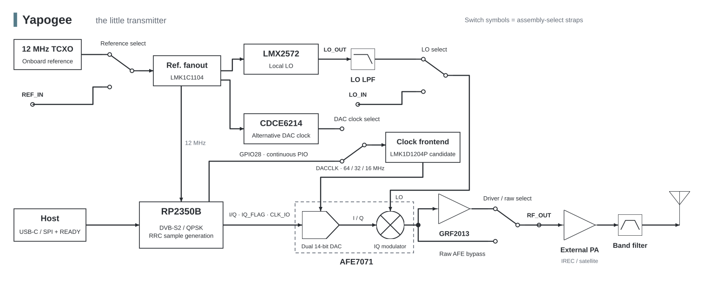

# Yapogee

Welcome, welcome, welcome! I went looking for a small, affordable QPSK transmitter and couldn't find what I wanted. So we're making one. Meet Yapogee: a little USB-C/SPI board that is ready to yap.

An onboard RP2350B handles DVB-S2 encoding and waveform generation; an AFE7071 turns those samples into RF. A shared reference, wideband LO and optional small driver round out the core. IREC at 1.24–1.30 GHz comes first, with 2.4 GHz satellite development sharing the core and using its own external PA/filter.

Choose onboard or injected reference and LO, PIO or synthesized DAC clock, and the small driver or raw AFE output. The [detailed dev-board diagrams](hardware/devboard/architecture/architecture.drawio) show how those paths connect.

For N samples per symbol, `f_IQ = N × R_s` and the interleaved bus runs at `f_bus = 2 × f_IQ`. At 8 Msym/s with N=4, that's 32 MS/s per I/Q channel and 64 Mwords/s on the bus. The proposed continuous PIO clock is `f_SYS / (2 × divider)`: 128 MHz / 2 = 64 MHz.

| Area | Contents |
|---|---|
| [Hardware](hardware/README.md) | Initial dev board, future transmitter board and hardware models |
| [Software](software/README.md) | Data path, timing, reference models and future cleaned firmware |

We're working toward the first dev board. KiCad files and module firmware are still ahead; clock input, power sequencing and thermals need closure before fabrication. The [existing digital benchmark](https://github.com/Rivercraft911/RP2350_IQ_Benchmark) supplies the starting point for a later cleaned firmware import.
