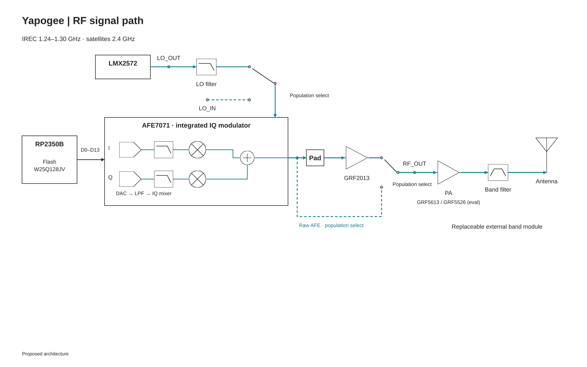

# Yapogee

RP2350B USB-C/SPI transmitter module: onboard waveform generation, AFE7071 DAC/IQ modulation, shared 12 MHz reference, LMX2572 LO and optional small RF driver. IREC at 1240–1300 MHz comes first; the core retains 2.4 GHz satellite coverage with different external PA/filter hardware.

| Area | Contents |
|---|---|
| [Hardware](hardware/README.md) | System diagrams, interfaces, component choices, board files and hardware models |
| [Software](software/README.md) | Data path, timing, reference models and future cleaned firmware |

**Status:** proposed architecture. Board files and module firmware are not released; AFE clock input, USB power admission and compact-module thermal design remain fabrication gates. Existing digital work is in [RP2350_IQ_Benchmark](https://github.com/Rivercraft911/RP2350_IQ_Benchmark); its code will be imported later after review.

The module is intended for castellated carrier mounting, optional digital headers, removable RF shielding, debug/test access, USB-C and regulated external 5 V. RF paths use qualified launches. Hardware simulations/models and software models live with their respective sections.

Project licensing is pending. Draw.io symbol attribution and license are recorded in the hardware section.
