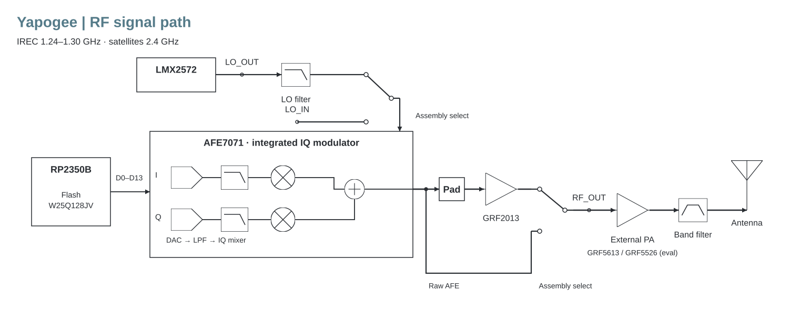

# Initial development board

Onboard RP2350B generates interleaved I/Q for AFE7071. A shared 12 MHz reference drives waveform timing and the full LMX2572 LO. GRF2013 supplies optional low-power drive; band PA/filter modules remain external. IREC 1240–1300 MHz is the first assembly; retain 2400–2450 MHz core coverage, with 2200–2290 MHz also within the selected devices' range.



[Editable architecture](architecture/architecture.drawio) · [Clock diagram](architecture/reference-clocks.svg) · [Power/interfaces](architecture/power-interfaces.svg)

## Components and references

| Function | Proposed part / reference |
|---|---|
| MCU / flash | RP2350B A4 (SC1510-A4), W25Q128JVSIQ; [official minimal KiCad](https://pip.raspberrypi.com/documents/RP-010329-CA-RP2350B%20Minimal%20KiCAD.zip), [hardware guide](https://datasheets.raspberrypi.com/rp2350/hardware-design-with-rp2350.pdf) |
| Reference / fanout | ECS-TXO-2520MV-120-AN-TR, LMK1C1104PWR; [oscillator](https://ecsxtal.com/store/pdf/ECS-TXO-2520MV.pdf), [fanout](https://www.ti.com/lit/ds/symlink/lmk1c1104.pdf) |
| DAC / IQ modulator | AFE7071IRGZT; [datasheet/IBIS](https://www.ti.com/product/AFE7071), [EVM guide](https://www.ti.com/lit/ug/slou337a/slou337a.pdf) |
| LO | LMX2572RHAT; [datasheet](https://www.ti.com/lit/ds/symlink/lmx2572.pdf), [EVM schematic/BOM](https://www.ti.com/lit/ug/snau217b/snau217b.pdf) |
| Clock comparison | GPIO28 dedicated PIO or CDCE6214RGET; conditional LMK1D1204PRHDT frontend; [CDCE](https://www.ti.com/product/CDCE6214), [exact P buffer](https://www.ti.com/lit/ds/symlink/lmk1d1204p.pdf) |
| Driver | GRF2013; [reference circuit](https://www.guerrilla-rf.com/includes/prodFiles/2013/GRF2013DS.pdf) |
| Quiet rails | TPS7A2133PQWDRBRQ1 digital; 2×TPS7A9101DSKR AFE; 2×TPS7A9401DSCR LO/reference; [models/EVMs](https://www.ti.com/product/TPS7A94), [AFE LDO](https://www.ti.com/product/TPS7A91) |
| Input / reset | TPS259470LRPWR, TPS386000RGPR, 2×TPS389001DSER; [input](https://www.ti.com/lit/ds/symlink/tps25947.pdf), [supervisor](https://www.ti.com/lit/ds/symlink/tps386000.pdf), [AFE monitors](https://www.ti.com/lit/ds/symlink/tps3890.pdf) |

Exact passives, connector/shield MPNs and populated variants await the schematic. AFE and some regulator/logic stock need current authorized-source quotes before schedule commitment.

## Interfaces

- **Power:** regulated 5 V, 4.75–5.25 V. Current all-LDO core/driver allocation ≈0.81 A / 4 W. USB-only full operation needs hardware source admission, provisionally ≥1.5 A Type-C advertisement; external 5 V supports USB data/programming from other hosts. Proposed CC detection and mux are [TUSB320LAI](https://www.ti.com/lit/ds/symlink/tusb320lai.pdf) and [TPS2116](https://www.ti.com/lit/ds/symlink/tps2116.pdf), with independent bias and reviewed admission control. Automatic priority alone is insufficient.
- **Host:** SPI SCK/MOSI/CS into module, READY outward, separate host I/O reference and default-off translation. Final pad numbers/timing are not released.
- **LO_OUT / LO_IN:** local LO → removable filter adapter → LO_IN, or an exclusively selected external generator. Isolate the inactive route at both roots. AFE-plane drive is −5 to +5 dBm; target +4 dBm and verify it at the AFE input. Common CMOS REF_IN is a separate 12 MHz interface.
- **RF:** exclusive raw-AFE or GRF2013 route with input-pad options. IREC evaluation PA is [GRF5613 EVB184](https://www.guerrilla-rf.com/includes/prodFiles/5613/GRF5613%20EVB184%201240-1420%20MHz.pdf); satellite low-power evaluation is [GRF5526 tune #180](https://www.guerrilla-rf.com/includes/prodFiles/5526/GRF5526%202200-2500MHz.pdf). Multi-watt video PA is separate. Each final PA has its own output filter, supply/bias, READY and local faults.
- **Mounting/debug:** castellations, multiple grounds/thermal bond, optional digital headers, SWD/BOOTSEL/RUN, LEDs and ground-referenced probes. Reserve a removable shield frame/lid. Dimensions, RF launch and carrier footprint follow placement/thermal/assembly analysis; no RF through ordinary headers.

## Board and model status

`board/` is reserved for KiCad sources; none are released. Shared hardware models are in `../simulations/`: [link/payload budget](../simulations/link_budget.py) and [ideal LO-loop screen](../simulations/reference_lo_loop_screen.py). They are analytical planning models, not SPICE/RF validation. Real stackup, device models and measurements will accompany later SI, power, PLL and RF-network studies.

Run from the repository root with Python 3; both use the standard library:

```sh
python3 hardware/simulations/link_budget.py
python3 hardware/simulations/reference_lo_loop_screen.py
```

The link model writes local `hardware/simulations/output/` tables/JSON. The loop screen prints JSON. Inputs and assumptions are recorded in the source and results.

Before fabrication: resolve AFE clock swing/bias/partial-power behavior; export/verify clock and PLL settings; close rail/USB/reset/watchdog corners; audit pins/footprints; define stackup/shield/carrier thermal bonding; and verify procurement. Keep clocks/reference hardware-on for boot. Clock OE is independent of PA arm/readiness. PA request precedes READY; LO CE powers calibration after path readiness, with RF muted until configuration is valid. RESET1 alone drives RUN/permission; independent monitor faults feed MR.

Rough 2026-10-02 component allowance: **$215–285 one-off / $170–230 at ten-board pricing**, before PCB, assembly, tax, lab hardware and external adapters/PAs. This is a planning estimate, not a released BOM or delivered quote.
